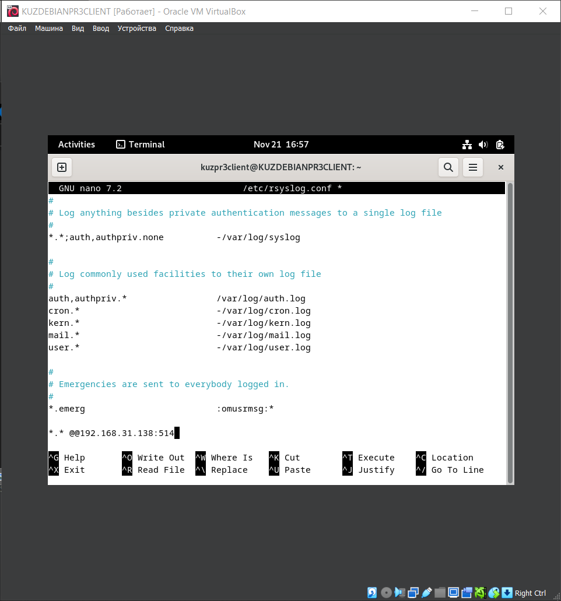

# TOIB-PR4-Kuzina-Anastasia-Sergeevna-BBMO-02-23

1. Создадим 2 виртуальные машины на базе ОС Debian 12 и обеспечим между ними сетевой обмен посредством сетевого моста

   

   

   
   
2. Включим на 1-ой (сервере) ВМ передачу логов по протоколу rsyslog на 2-ую ВМ (клиент)
   
   **Устанавим и настраим rsyslog на сервере и клиенте**

   

   **Проверим работоспособность rsyslog на сервере и клиенте**

   

   **Включим UDP и TCP соединения**

   

   **Устанавливим правила на сервере**
   
   

   **Установливим правила на клиенте**
   
   

   **Проверим получения логов на сервере**
   
   

   

4. Установим и настроим получение логов на сервер с использованием Loki
   
   **Установим и отредактируем docker compose файл на сервере**
 
   
   
   
   
   **Запустим Loki**
 
   
 
   **Отредактируем promtail-config на клиенте**
 
   

   **Отредактируем docker compose файл для promtail**
 
   
  
   **Запустим promtail на клиенте**
 
   

   **Просматрим логи клиента в Grafana**
 
   

   
 
 5. Устанавливим и настроим получение логов на сервере с использованием Signoz

   _Установка Signoz по инструкции с сайта: https://signoz.io/docs/install/docker/#install-signoz-using-docker-compose_

   **Запустим Signoz**
   
   
   
   
   
   
   
   **Отредактируем конфигурации на клиенте для отправки данных в Signoz**
   
   _Устнаовка приложения sample-nodejs-app согласно инструкции с сайта: https://github.com/SigNoz/sample-nodejs-app/_
   
   

   **Запустим клиентское приложение sample-nodejs-app**
   
   
   
   **Проверим получение логов в Signoz**
   
   
   
   
